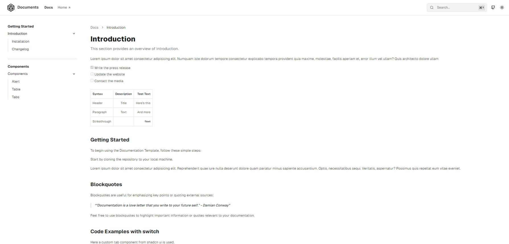

# Taizun

Taizun is a Python library that simplifies machine learning tasks by providing utility functions for Natural Language Processing (NLP) and Computer Vision.

> **Demo**: [https://taizun.vercel.app](https://taizun.vercel.app)

[](LICENSE)
[](https://github.com/t4zn/taizun)


[](https://github.com/t4zn/taizun/commits)
[](https://github.com/t4zn/taizun/issues)
[](https://github.com/t4zn/taizun/pulls)

[](https://github.com/t4zn/taizun/stargazers)
[](https://github.com/t4zn/taizun/network)
[](https://github.com/t4zn/taizun)

[](https://vercel.com/new/clone?repository-url=https%3A%2F%2Fgithub.com%2Ft4zn%2Ftaizun&project-name=taizun&repository-name=taizun&demo-title=Taizun&demo-description=Taizun%20is%20a%20Python%20library%20that%20simplifies%20machine%20learning%20tasks%20by%20providing%20utility%20functions%20for%20Natural%20Language%20Processing%20(NLP)%20and%20Computer%20Vision.&demo-url=https%3A%2F%2Ftaizun.vercel.app%2F&demo-image=https%3A%2F%2Fgithub.com%2Ft4zn%2Ftaizun%2Fblob%2Fmain%2Fpublic%2Fscreens%2Fscreen-1.png)

---

## Overview

Taizun enables developers to accelerate their machine learning workflows with ready-to-use functions for NLP and Computer Vision tasks.

Built for Python developers, this library supports common machine learning operations with a focus on simplicity and efficiency.

---

## Features

### Natural Language Processing

- Text preprocessing and cleaning
- Named Entity Recognition
- Sentiment Analysis
- Text Summarization
- Word Frequency Analysis

### Computer Vision

- Image classification
- Object detection
- Image captioning
- Basic image processing

### Mathematical Operations

- Calculator functions
- Statistical operations
- Mathematical utilities

### String Processing

- Text manipulation
- String formatting
- Pattern matching

### Logical Operations

- Data validation
- Type checking
- List operations

---

## Quick Start

### Installation

```bash
git clone https://github.com/t4zn/taizun.git
cd taizun
pnpm install
pnpm run dev
```

Visit [http://localhost:3000](http://localhost:3000) to view your project locally.

**For production:**

```bash
pnpm run build
pnpm run start
```

Deploy to Vercel for automated builds and hosting.

---

## Usage

Taizun is designed to support:

- Machine learning projects
- NLP applications
- Computer vision tasks
- Data processing workflows

---

## Screenshots


_Main Screen_


_Document Screen_


_Document Footer_


_Document Search_


_Main Dark Mode Screen_


_Document Dark Mode Screen_

---

## Contributing

We welcome contributions to improve this project.

1. Fork the repository
2. Create a feature branch
3. Commit your changes
4. Open a pull request

---

## License

This project is licensed under the MIT License. See the [LICENSE](./LICENSE) file for details.

---

## Contact

For support or inquiries:

t4zn — [@t4zn](https://x.com/t4zn)

**Project:** [https://github.com/t4zn/taizun](https://github.com/t4zn/taizun)